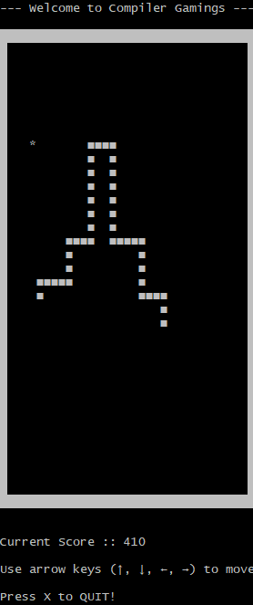

# Snake Game

Welcome to Compiler Gamings implementation of the classic Snake Game in C. This simple console-based game allows you to control a snake, eat fruits, and avoid collisions with walls and itself.

## Table of Contents

- [Introduction](#introduction)
- [Features](#features)
- [How to Play](#how-to-play)
- [Preview](#preview)
- [Installation](#installation)
- [Usage](#usage)
- [Code Overview](#code-overview)
- [Contributing](#contributing)
- [License](#license)

## Introduction

This project implements the Snake Game using basic C programming concepts. It features a snake that moves within a defined boundary, grows in length upon eating fruits, and ends the game upon collision with walls or itself.

## Features

- Clear console-based interface with boundaries and snake segments.
- Dynamic fruit generation and scoring system.
- Arrow key controls for snake direction.
- Game over conditions for collisions and boundary exits.
- Option to restart the game after each session.

## How to Play

1. Run the game.
2. Use arrow keys (↑, ↓, ←, →) to control the snake's direction.
3. Eat the '\*' symbols to increase your score and snake length.
4. Avoid collisions with the walls ('█') and your own body ('■').
5. Press 'X' to quit the game at any time.

## Preview



## Installation

### Linux

To run the Snake Game on your Linux system, follow these steps:

1. Clone the repository:
   ```sh
   git clone https://github.com/amit712singhal/Snake-Game.git
   ```
2. Navigate to the project directory:
   ```sh
   cd snake-game
   ```
3. Compile the code:
   ```sh
   gcc main.c -o main
   ```
4. Run the game:
   ```sh
   ./main
   ```

Well this one is a lengthy procedure as Windows doesn't support termios header file and I have tried all other ways around it but the code doesn't seem to work properly . so here is how this goes->

### Windows (using Cygwin)

If you're using Windows and want to run the Snake Game, you can follow these steps to set it up using Cygwin, which provides a Unix-like environment:

1. **Install Cygwin:**

   - Follow this guide to install Cygwin on your Windows machine: [Install Cygwin on Windows](https://github.com/lakelse/videos/tree/master/01-install-cygwin-on-windows-youtube).
   - During the installation:
     - Choose a download site (e.g., https://muug.ca or any preferred mirror).
     - Select the following packages in the Cygwin setup:
       - `cygwin-devel`
       - `gcc-core`
       - `gcc-g++`
       - These packages are necessary for compiling C programs (also resolves `termios.h` header file error)

2. **Open Cygwin Terminal:**

   - Launch Cygwin from the Start menu or desktop shortcut.

3. **Navigate to the Snake Game directory:**

   ```sh
   cd '<your directory name>'
   ```

   Replace `<your directory name>` with the actual path to your Snake Game project directory.

4. **Compile the code:**

   ```sh
   gcc main.c -o main
   ```

5. **Run the game:**
   ```sh
   ./main
   ```

## Usage

Once the game is running, follow the on-screen instructions to control the snake. The game will display the current score and prompt you to play again or quit after each session.

## Code Overview

The main functions in `snake_game.c` and their purposes are:

- `main()`: Initializes the game environment and manages game flow.
- `dr_boundary()`: Draws the game boundary, snake segments ('■'), fruits ('\*'), and displays the score.
- `setup()`: Initializes the snake's starting position, generates fruits, and resets the score.
- `add_segment()`: Increases the snake's length upon eating a fruit.
- `input()`: Handles user input for snake direction using arrow keys.
- `logic()`: Implements the game logic including snake movement, collision detection, and fruit consumption.

## Contributing

Contributions to this project are welcome! If you find any bugs or have suggestions for improvements, please create an issue or submit a pull request.

1. Fork the repository.
2. Create your feature branch (`git checkout -b feature/YourFeature`).
3. Commit your changes (`git commit -am 'Add some feature'`).
4. Push to the branch (`git push origin feature/YourFeature`).
5. Create a new Pull Request.

## License

This project is licensed under the MIT License. See the [LICENSE](LICENSE) file for details.
